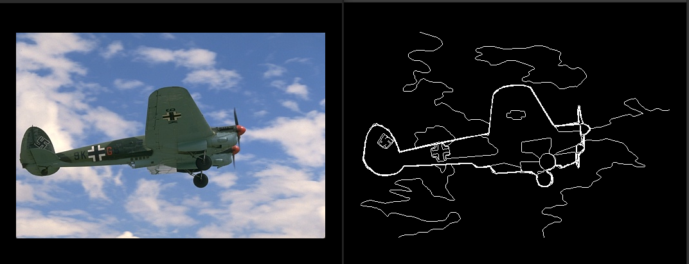
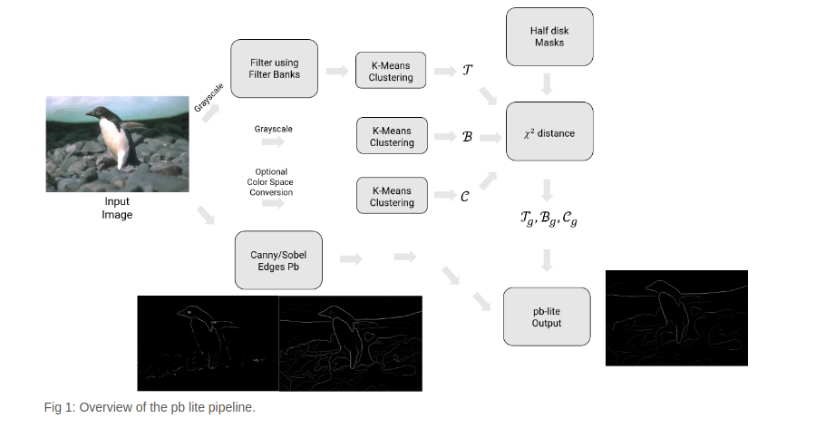
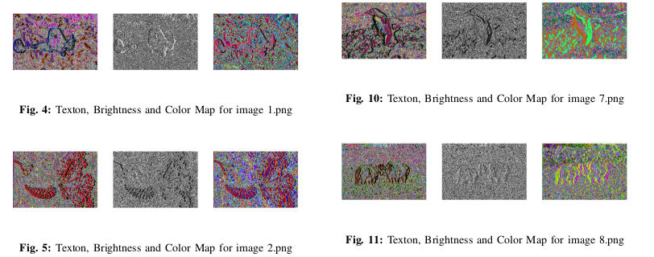
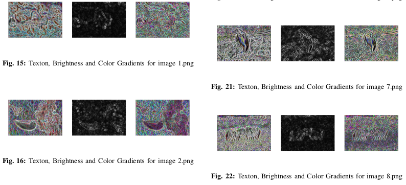
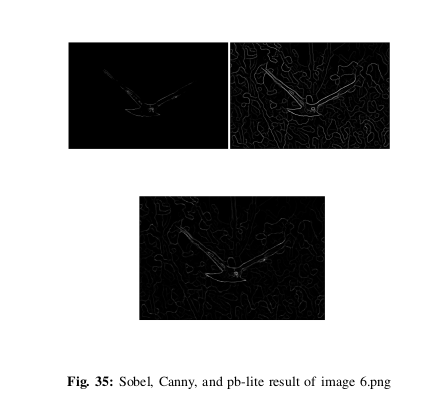

# Boundary-Detection

# Introduction

Boundary detection and image classification are two well
known computer vision problems. The challenging part of
the boundary detection is when we are doing the boundary
detection from a single image. Is this case we cannot use most
of the recent deep learning methods. In this project I use the most recent
pb (probability of boundary) boundary detection algorithm and compare it to [Canny](https://ieeexplore.ieee.org/document/4767851) and [Sobel](https://en.wikipedia.org/wiki/Sobel_operator) baselines. The following shows the overall baseline.

## Filter bank implementation
I’m implementing three kind of filter banks; oriented deriva-
tive of Gaussian (DoG) filter, Leung-Malik filter, and Gabor
filter.

## Texton, brightness, color map computation
In the next step, we implement texton, brightness, and color
map. I generate texton map by convolving the previous filter
banks with the images and map them into 64 clusters and
taking the average. The concept of the brightness map is as
simple as capturing the brightness changes in the image and
cluster it into 16 groups. Also, The concept of the color map
is to capture the color changes. Then cluster it into 16 clusters.
Illustration of the generated map are shown in following figures.

Using half-disc masks along with the Chi-square
distance, we can generate the gradient map for all texture,
brightness, and color information of the images. the generated
gradients are shown in the following.

## Boundary detection
The final step to get the boundaries is to combine informa-
tion from the features with Sobel or Canny edge detection by
computing the dot product between the average of gradients
and the average of Canny ans Sobel.

# Analysis

The result is not as clear as the Canny baseline, however,
it’s better than the Sobel base line. In some degree, the Pb-
lite is better than Canny since it does not have false positive
results. We can see a lot of incorrect edges in the Canny which
are not presented in the Pb-lite. It should be also mentioned
that it’s a possible that I don’t chose the best filter bank to do
it, even though I tried different sizes and filters. you can see the following
figure to cpmpare Sobel, Canny, and pb-lite results.

